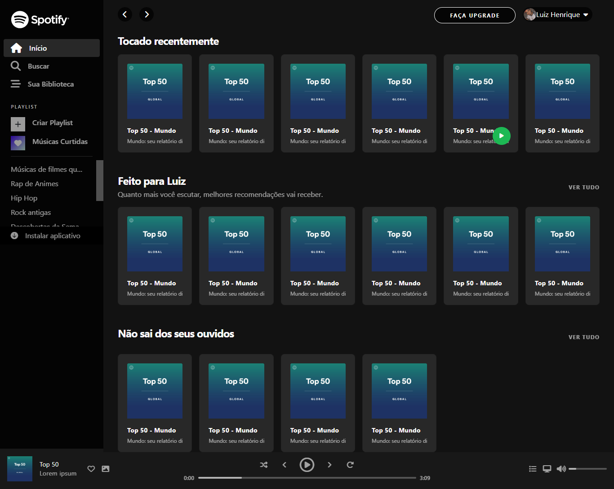

# Layout do Spotify com  CSS grid

Clone do Spotify.
[🔗Clique aqui para acessar](https://luizhenr1que.github.io/layoutSpotify/)

## 🛠 Tecnologias
- HTML
- CSS
- JavaScript
- Bootstrap
- Git e Github

## 😁 O que aprendi 
Aprendi nesse layout CSS grid. E também aprendi um pouco mais de JavaScript. 
## 🤍 Contato
luizhenriquejob4@gmail.com 